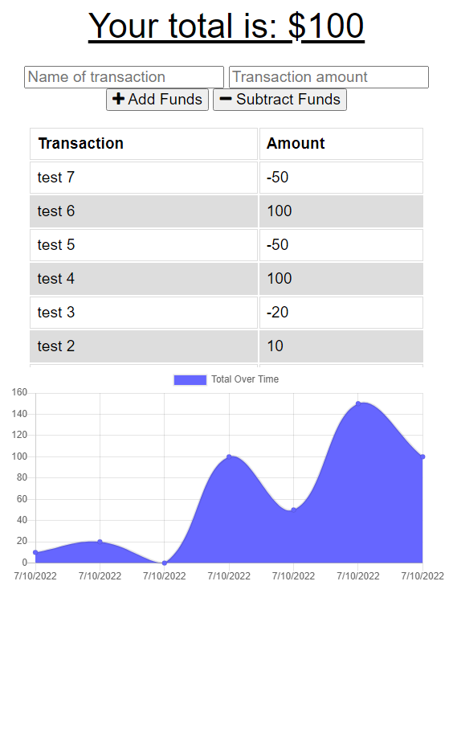

# PWA-budget-tracker

## Table of Contents
- [Description](#description)
- [Built With](#built-with)
- [Contribution](#contribution)
- [Website Link](#website-link)
- [Screenshot](#screenshot)

## Description
This application is intended to allow users to keep track of their funds with or without an internet connection. The application will cache user inputs and upload them to the database when an internet connection is established

This application also serves as a submission to an assignment testing students' abilities creating Progressive Web Applications (PWAs) using service workers, web mainfests, and IndexedDB.

## Built With
- HTML
- CSS
- JavaScript
- Node.js
    - Compression
    - Express
    - Mongoose
    - Morgan
- MongoDB

## Contribution
- Created by Micah Zahn.
- Starter code and code snippets provided by University of Wisconsin Extended Campus Coding Bootcamp.

## Website Link
https://safe-beach-90151.herokuapp.com/

## Screenshot
